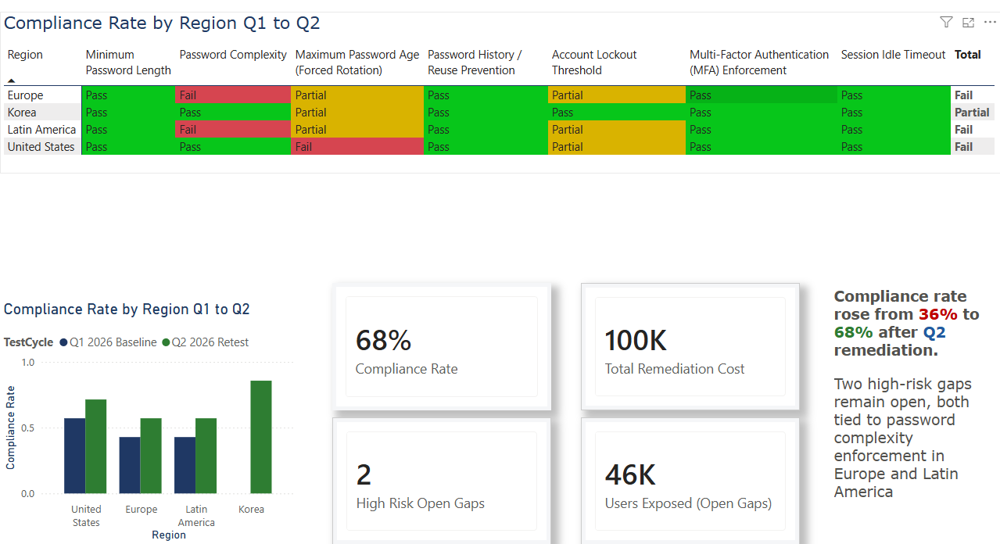
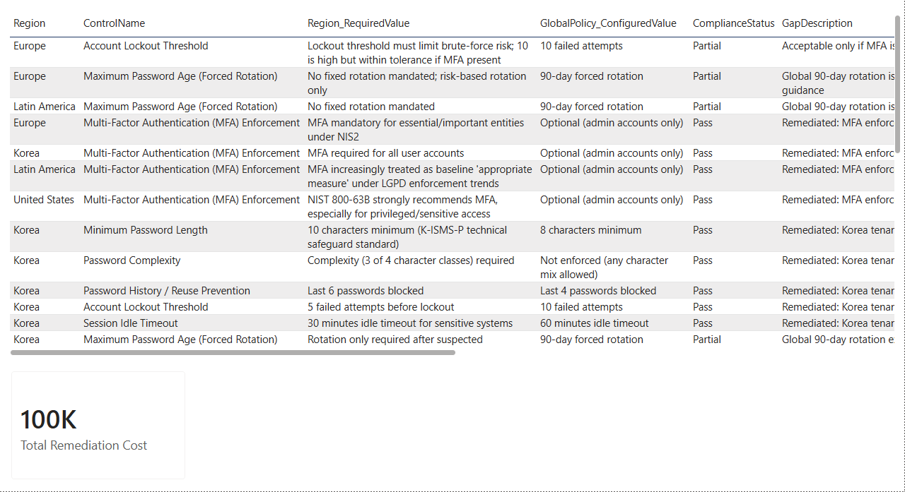
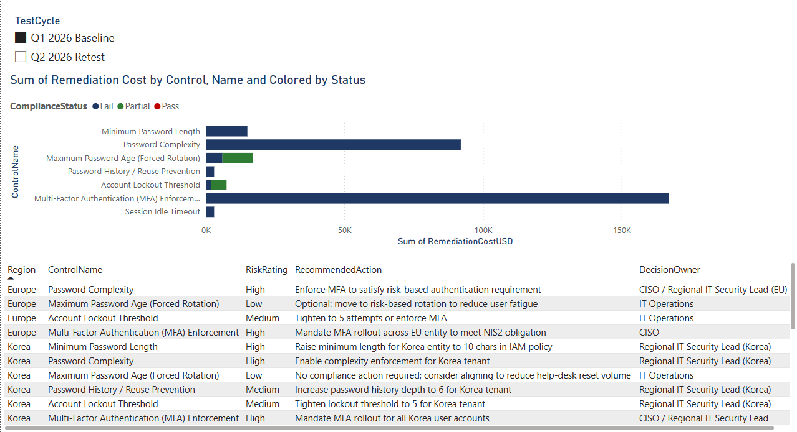

# Global Password Policy Compliance Dashboard

**A Power BI dashboard that tests one company's password policy against the real security and privacy frameworks of four operating regions — and turns the technical gaps into a business decision.**

## The Problem

Novantek Global*, a fictional multinational device manufacturer, runs a single global password policy. But "secure" isn't a single bar — Korea, the EU, the US, and Brazil each have different technical requirements under their own frameworks. A policy that satisfies one region can fail another, or in some cases be *stricter than necessary*, adding user friction without a compliance benefit.

*Modeled on a real multinational hardware company's actual global regulatory footprint. All test results, dates, and costs are fictional and built for portfolio demonstration.

This project tests that policy control-by-control, region-by-region, against:

| Region | Framework |
|---|---|
| 🇰🇷 Korea | K-ISMS-P |
| 🇪🇺 Europe | ISO/IEC 27001 + EU NIS2 Directive |
| 🇺🇸 United States | NIST SP 800-63B |
| 🇧🇷 Latin America | LGPD |

## The Decision

The dashboard doesn't stop at red/green status — it prices out two real options for leadership: adopt one strict global baseline (simple to govern, higher cost, some regions over-controlled), or maintain region-specific policies (cheaper, right-sized, harder to audit). See the [Executive Decision Brief](docs/Novantek_Executive_Decision_Brief.docx) for the full write-up.

## Screenshots

**Executive Summary**

**Regional Detail**

**Remediation Tracker**

## What's in this repo

| File | Description |
|---|---|
| `Novantek_PasswordPolicy_Dashboard.pbix` | The full Power BI report — open in Power BI Desktop |
| `data/Novantek_PasswordPolicy_ControlTesting.xlsx` | Source dataset: star schema with region, framework, control, and control-test fact tables across two test cycles |
| `docs/PowerBI_Build_Guide.md` | Data model, DAX measures, and page-by-page build notes |
| `docs/Novantek_Executive_Decision_Brief.docx` | One-page, non-technical decision brief for leadership |
| `screenshots/` | Dashboard page exports |

## Skills demonstrated

- Mapping technical controls to multiple real-world regulatory/security frameworks (K-ISMS-P, ISO 27001, NIS2, NIST 800-63B, LGPD)
- Star-schema data modeling and DAX (compliance rate, cost aggregation, cycle-over-cycle trend measures)
- Translating technical findings into a cost/risk-based business decision for non-technical stakeholders
- Tracking remediation over time (baseline vs. retest) rather than a single point-in-time snapshot

## Data disclaimer

Company name, test results, dates, costs, and the global policy configuration are fictional, built for this portfolio project. Framework names, the regions they apply to, and their general publicly documented requirements are real — see `Dim_Framework` in the source data for citations.
